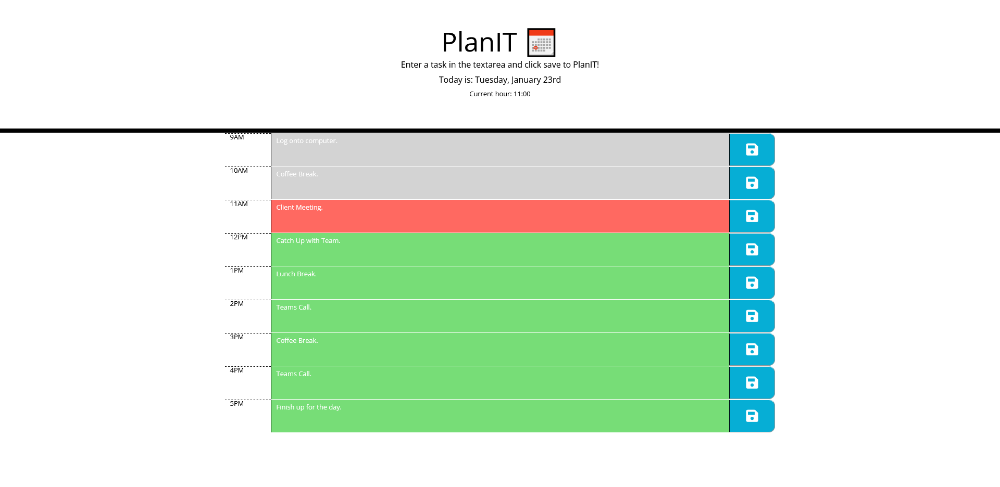

# PlanIT 📅
This is the official repository of PlanIT - a JavaScript based working day planner.

Tired of forgetting what you were meant to do whilst at work? Plan your time efficiently with PlanIT! 📅

## Description

The motivation behind PlanIT was that, as an employee with a busy schedule I found it difficult to keep track of what I was doing at what time during the day. The main aim of this project was to have an application which would allow me to add important events to a daily planner, so I can keep track of what I'm meant to be doing through the day.

There were a few problems which I faced, which led to the planning of this project:

- I had no way of tracking my daily tasks unless I wrote them down 📔
- If I forgot to pickup my notepad, I lost my daily flow 👎
- I was going through a lot of paper, frequently 📖

The solution to these problems was to build an application using JavaScript, Jquery, dayJS, HTML and CSS which would allow me to see time blocks for my standard working day and add a task for each hour, and save it. When I want to update what I have planned for a certain time, I just click into the text area for that hour, update the text and click save and it updates the task. By implementing these features in my code, it has allowed me to manage my time effectively and cut down on my paper use - and it's saved me alot of headaches along the way.

This project has been a great learning experience for me and it's given me the skills to be able to create dynamic web applications that are useful for everyday tasks.

## Table of Contents

- [Description](#description)
- [Installation](#installation)
- [Credits](#credits)
- [License](#license)

## Installation

N/A

## Usage

Plan your time efficiently <a href="https://reececorkhill.github.io/Plan-IT/"> here</a>!

## Credits

PlanIT was developed by <a href="https://github.com/reececorkhill">reececorkhill</a>.

## License

MIT License

Copyright (c) 2024 reececorkhill

Permission is hereby granted, free of charge, to any person obtaining a copy
of this software and associated documentation files (the "Software"), to deal
in the Software without restriction, including without limitation the rights
to use, copy, modify, merge, publish, distribute, sublicense, and/or sell
copies of the Software, and to permit persons to whom the Software is
furnished to do so, subject to the following conditions:

The above copyright notice and this permission notice shall be included in all
copies or substantial portions of the Software.

THE SOFTWARE IS PROVIDED "AS IS", WITHOUT WARRANTY OF ANY KIND, EXPRESS OR
IMPLIED, INCLUDING BUT NOT LIMITED TO THE WARRANTIES OF MERCHANTABILITY,
FITNESS FOR A PARTICULAR PURPOSE AND NONINFRINGEMENT. IN NO EVENT SHALL THE
AUTHORS OR COPYRIGHT HOLDERS BE LIABLE FOR ANY CLAIM, DAMAGES OR OTHER
LIABILITY, WHETHER IN AN ACTION OF CONTRACT, TORT OR OTHERWISE, ARISING FROM,
OUT OF OR IN CONNECTION WITH THE SOFTWARE OR THE USE OR OTHER DEALINGS IN THE
SOFTWARE.
